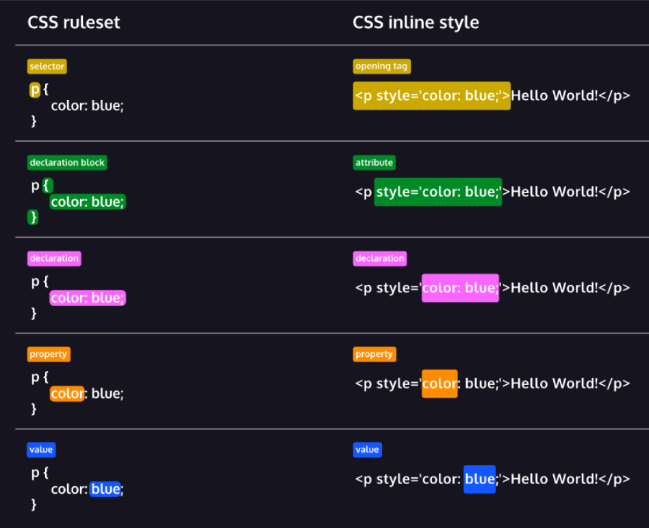

# Fundamentals of CSS3

## Fundamentals of CSS3 Objective

In this section I'll show you the following concept

- Selector and Visual Rule
- The Box Models
- Display and Positioning

[MDN Reference](https://developer.mozilla.org/en-US/docs/Web/CSS)

## SetUp and Syntax

### Intro to CSS

CSS or cascading style sheet is used to make the web page more appealing

### CSS Anatomy



### Inline style

you can directly add CSS within HTML

```css
<p style='color: red; font-size: 20px;'>I'm learning to code!</p>
```

### Internal Stylesheet

When we use the `inline style` we need to manually change it one by one which is not a good practice. But we have another method that uses the `internal stylesheet`.

it written within the head element

```css
<head>
  <style>
    p {
      color: red;
      font-size: 20px;
    }
  </style>
</head>
```

### External Stylesheet

Developer write avoid writing mix code which mean HTML with CSS so what they do is they separate those file.

for CSS they put `.css` file extension

### Linking the CSS File

in order to make HTML file locate the CSS file we need to link it together

```css
<link href='./style.css' rel='stylesheet'>
```

1. `href` — like the anchor element, the value of this attribute must be the address, or path, to the CSS file.
2. `rel` — this attribute describes the relationship between the HTML file and the CSS file. Because you are linking to a stylesheet, the value should be set to `stylesheet`.

### Review

- The basic anatomy of CSS syntax written for both inline styles and stylesheets.
- Some commonly used CSS terms, such as ruleset, selector, and declaration.
- CSS inline styles can be written inside the opening HTML tag using the style attribute.
- Inline styles can be used to style HTML, but it is not the best practice.
- An internal stylesheet is written using the <style> element inside the <head> element of an HTML file.
- Internal stylesheets can be used to style HTML but are also not best practice.
- An external stylesheet separates CSS code from HTML, by using the “.css”.file extension.
- External stylesheets are the best approach when it comes to using HTML and CSS.
- External stylesheets are linked to HTML using the <link> element.

## Selector

### Type

the _selector_ will target the element we want to style by declaration.

_type selector_ use to target specific HTML elements to be styled.

_type selector is_ often called _element selector_ or _name selector._

### Universal

Universal selects all elements on the page it use to

- Reset default sytle on a page
- selecting all children of a parents element

### Class

You can select and style elements with HTML class

### Multiple Classes

in CSS we can apply more than one class of an element

```css
.green {
  color: green;
}

.bold {
  font-weight: bold;
}
```

```css
<h1 class='green bold'> ... </h1>
```

### ID

If we want style HTML element unique on the page we can use ID

ID value can only use once on a page

### attribute

As we learn from the HTML section attributes use to give more detail and functionality

We can use attribute selector to select HTML element to be style

```css
[href] {
  color: magenta;
}
```

```css


```

```css
img[src*="winter"] {
  height: 50px;
}
img[src*="summer"] {
  height: 100px;
}
```

### Scaling

Alter the size of an object.

[MDN Reference](https://developer.mozilla.org/en-US/docs/Web/CSS/transform-function/scale)

#### Example

```css
div {
  transform: scale(2);
  /* Will double the size of the div */
}
div {
  transform: scaleX(1.5);
  /* Will expand the element horizontally */
  transform: scaleY(0.5);
  /* Will shrink the element vertically */
}
div {
  transform: scale(4, 0.25);
  /* Will expand the element horizontally, and shrink it vertically */
}
```

In the example in folder `7_scale`, you will notice that when an element is scaled, everything scales. This includes the font and the border. Scale, by default, scales from the element's center. It expands or shrinks evenly on both or all sides. This can be changed by a propery called **transform-origin**.

This will put the origin in the top left of the element, so it from that point, making the element grow down and to the right.

```css
div {
  transform: scale(2);
  transform-origin: 0 0;
}
div {
  transform: scale(2);
  transform-origin: top left;
  /* Same as above example, written in an alternate form */
}
```

### Rotate

Using CSS to... Rotate things!

[MDN Reference](https://developer.mozilla.org/en-US/docs/Web/CSS/transform-function/rotate)

#### Example

```css
div {
  transform: rotate(45deg);
  /* Positive is clockwise, negative is counter-clockwise */
}
```

> NOTE: Rotate seems like something that wouldn't be used very often, but a common use case for it is loading icons!
> **Transform-origin** also applies to rotate. By default, things rotate around their center, but we can change it to rotate around a side or a corner. It functions exactly the same as when we used it with `scale()`.

### Multiple Transforms

When performing multiple transformations on an element, the syntax requires all of the functions be within a single transform property:

```css
/* WRONG */
div {
  transform: rotate(90deg);
  transform: scale(0.5);
}
/* RIGHT */
div {
  transform: rotate(90deg) scale(0.5);
}
```

Refer to the example in folder `8_rotate` to see it in action.

## Vendor(Browser) Prefixes

[MDN Reference](https://developer.mozilla.org/en-US/docs/Glossary/Vendor_Prefix)

Use an auto-prefixer to do the work for you. [Here's one.](https://autoprefixer.github.io/)

## Transitions

Allow us to control animation speed when changing CSS properties.

> Double the size of this div **over 3 seconds**
> There are 4 transition properties that we can control

1. transition-duration
2. transition-property
3. transition-timing-function
4. transition-delay

### Transition-duration

How long the transition should last.

[MDN Reference](https://developer.mozilla.org/en-US/docs/Web/CSS/transition-duration)

`transition-duration: 1s;`

`transition-duration: 0.5s`

`transition-duration: 3s, 1s`

An example is in the folder `9_transition-duration`.

The reason we can give the `transition-duration` multiple durations is because we can give the `transition-property` multiple properties. Each duration pertains to a specific property determined by their order of listing.

#### Example

```css
div {
    transition-duration 4s, 0.5s;
    transition-property: background, border-radius;
    /* The background transition happens over 4 seconds, the border-radius transition happens over 0.5 seconds. */
}
```

### Transition-property

What properties that will be transitioned.

[MDN Reference](https://developer.mozilla.org/en-US/docs/Web/CSS/transition-property)

`transition-property: background;`

`transition-property: opacity;`

`transition-property: all;`

`transition-property: color, opacity;`

Refer to `transition-duration` example above.

### Transition-delay

How long of a delay before the transition starts.

[MDN Reference](https://developer.mozilla.org/en-US/docs/Web/CSS/transition-delay)

`transition-delay: 4s;`

`transition-delay: 5ms, 10s;`

Delay times can be comma separated just like `transition-property` and `transition-duration` for the same reason. Each value corresponds to the property value based on their order.

#### Example

```css
.animated {
  transition-property: background, border-radius;
  transition-duration: 1s, 1s;
  transition-delay: 5s, 2s;
}
```

### Transition-timing-function

The "acceleration curve" for the transition.

[MDN Reference](https://developer.mozilla.org/en-US/docs/Web/CSS/transition-timing-function)

`transition-timing-function: ease-in;`

`transition-timing-function: ease-out;`

`transition-timing-function: linear;`

and even...

`transition-timing-function: cubic-bezier(0.950, 0.050, 0.795, 0.035);`

Refer to [this site](http://easings.net/) for all different types of easings. When clicking on one, it will give you the function to use to make it.

#### Example

```css
.animated {
  transition-property: transform;
  transition-duration: 0.5s;
  transition-timing-function: cubic-bezier(0.175, 0.885, 0.32, 1.275);
}
```

### Shorthand Transitions

`transition: background 1.5s ease-in 1;`

`background` is `transition-property`, `1.5s` is `transition-duration`, `ease-in` is `transition-timing-function`, and `1` is `transition-delay`.

[MDN Reference](https://developer.mozilla.org/en-US/docs/Web/CSS/transition)

#### Example

```css
.animated {
  transition: transform 0.5s cubic-bezier(0.175, 0.885, 0.32, 1.275) 1s, background-color 0.5s linear;
}
/* is the same as */
.animated {
  transition-property: transform, background-color;
  transition-duration: 0.5s, 0.5s;
  transition-timing-function: cubic-bezier(0.175, 0.885, 0.32, 1.275), linear;
  transition-delay: 1s, 0;
}
```

### Animation Performance

There are 2 important questions to ask when using transitions:

1. What can be transitioned?
2. What should be transitioned?

#### What can be transitioned?

[These! (MDN Reference)](https://developer.mozilla.org/en-US/docs/Web/CSS/CSS_animated_properties)

#### What should be transitioned?

What performs best? These 4:

```
transform: translate();
transform: scale();
transform: rotate();
opacity
```

It's recommended that you try to stick to these 4 if you're concerned about performance. [Here is a resource to learn about it.](https://www.html5rocks.com/en/tutorials/speed/high-performance-animations/)
